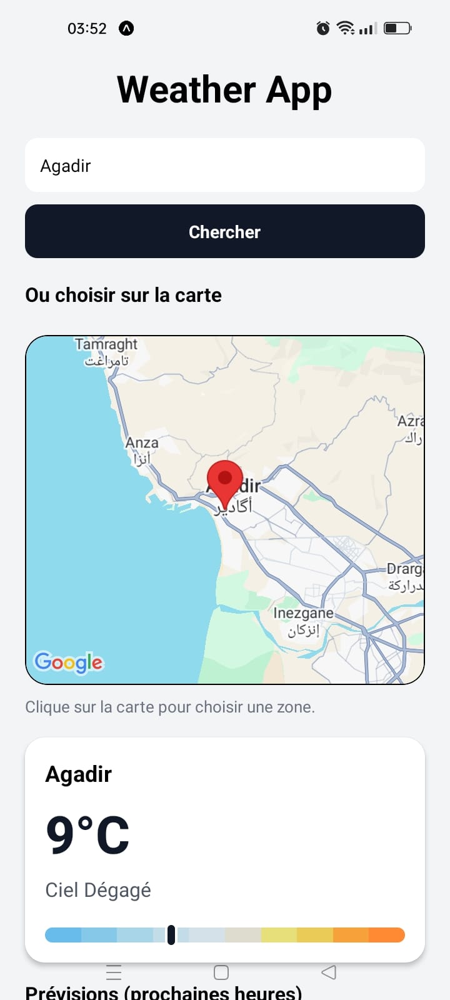
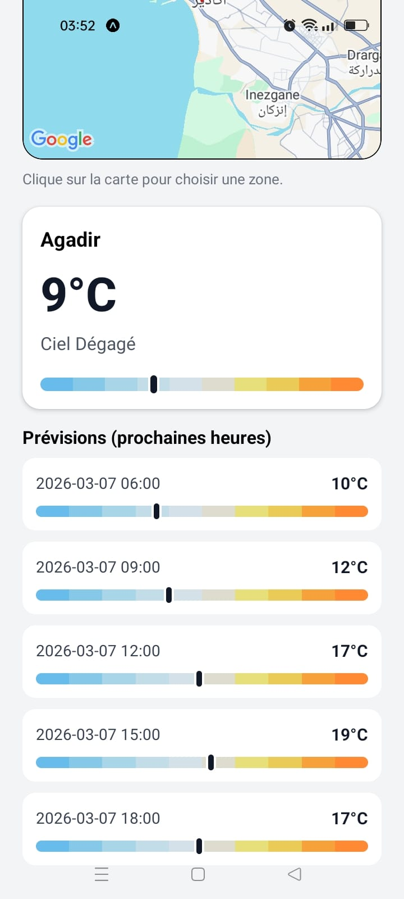

# Weather App

A mobile weather application built with **React Native (Expo)** that allows users to retrieve weather information for any location either by **searching a city** or **selecting a position on a map**.

The application displays the **current weather conditions** and **short-term forecasts**, providing a simple and intuitive way to explore weather data.

---

## Overview

This project demonstrates how to integrate external APIs, interactive maps, and dynamic UI components within a React Native application.

Users can:

* Search for a city to retrieve weather data
* Select a location directly on the map
* View the current temperature and weather condition
* Check short-term forecasts for the selected location

The application is designed with a clean mobile interface and focuses on usability and clarity.

---

## Screenshots

| Home Screen                   | Forecast                              |
| ----------------------------- | ------------------------------------- |
|  |  |


---

## Features

* City-based weather search
* Interactive map location selection
* Current weather display
* Short-term weather forecasts
* Responsive mobile interface
* Integration with external weather APIs

---

## Technologies

* **React Native**
* **Expo**
* **JavaScript**
* **OpenWeather API**
* **React Native Maps**

---

## Project Structure

```
.
├── src
│   ├── components
│   │   ├── WeatherCard.js
│   │   └── ForecastList.js
│   │   └── MapPicker.js
│   │
│   ├── services
│   │   └── weather.js
│   │
│   └── utils
│       └── temperatureScale.js
│
├── screenshots
├── App.js
├── package.json
└── README.md
```

* **components/** – UI components used to display weather data
* **services/** – API requests and data fetching logic
* **utils/** – helper functions used across the application

---

## Installation

Clone the repository:

```
git clone https://github.com/soufiane-ech/weather-mobile-app.git
```

Navigate into the project directory:

```
cd weather-mobile-app
```

Install dependencies:

```
npm install
```

Start the development server:

```
npx expo start
```

You can then run the application using:

* **Expo Go (mobile device)**
* **Android emulator**

---

## API Configuration

The application uses the **OpenWeather API** to retrieve weather data.

1. Create an account at
   https://openweathermap.org

2. Generate an API key.

3. Replace the API key inside:

```
src/services/weather.js
```

Example:

```javascript
const OPENWEATHER_API_KEY = "YOUR_API_KEY";
```


